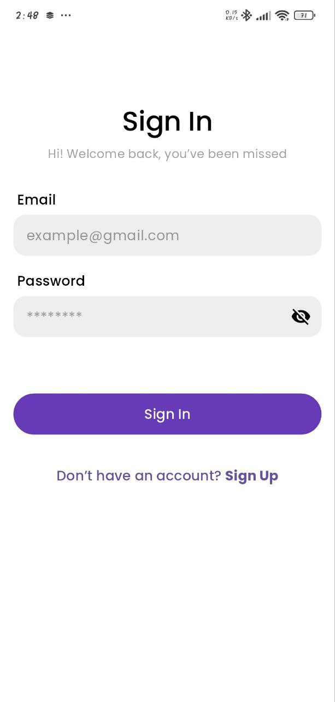
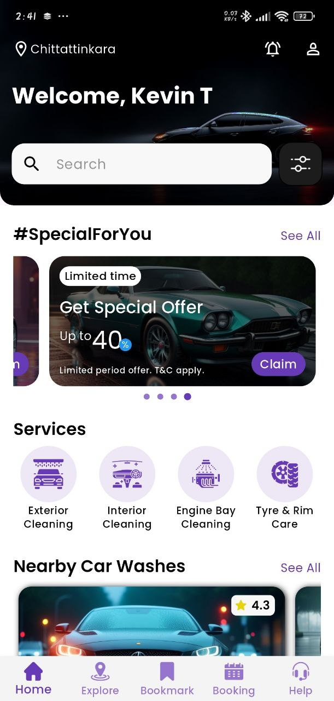
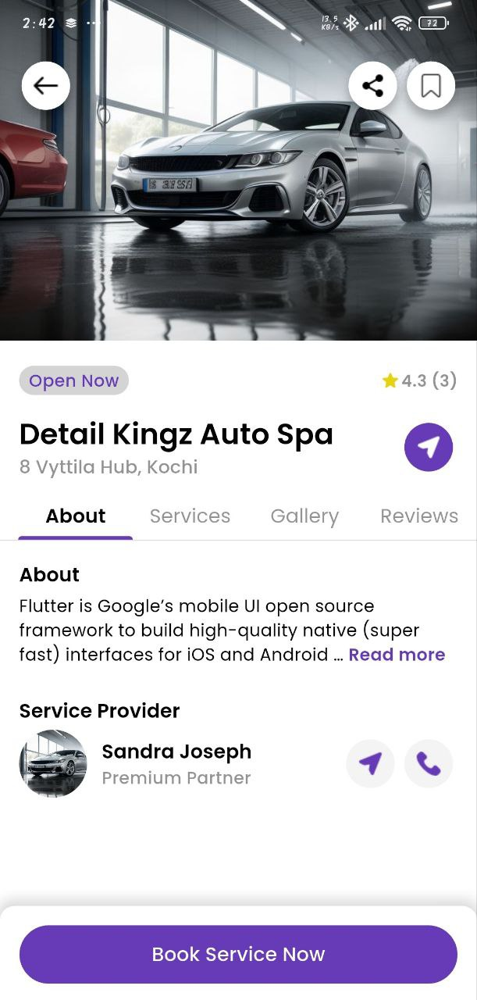
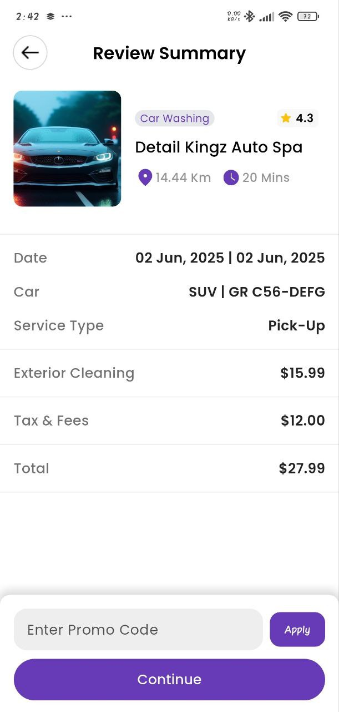
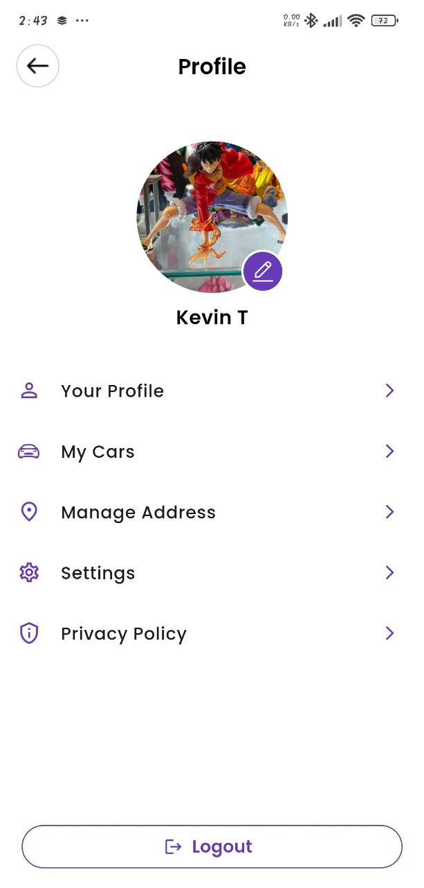

# 🚗 Axilo – Car Service Booking App

Axilo is a Flutter-based mobile application for car servicing, allowing users to explore nearby providers, book appointments, and manage vehicle information. Built with Firebase, GetX, and Stripe integration.

---

## 🔧 Tech Stack

- **Framework**: Flutter
- **State Management**: GetX
- **Backend**: Firebase Firestore, Firebase Authentication
- **APIs Used**:
  - LocationIQ (for place name by coordinates)
  - OSRM (for polyline route/distance)
  - Stripe (payment)
  - ImgBB (for image upload)
- **Other Services**:
  - Firebase Crashlytics (for crash monitoring)
  - Google Maps SDK (for maps and markers)

---

## 📂 Project Structure

The app follows a modular, feature-first structure.  
Here’s a high-level look at the folder breakdown:
 
```
lib/
├── common/        # Shared widgets and methods
├── core/          # App-wide core layers (data, models, services, etc.)
├── features/      # Main feature modules like auth, booking, map, etc.
├── utils/         # Helpers: constants, config, firebase, etc.
├── main.dart      # App entry point
└── routes.dart    # Route configuration
```
Each screen or module has its own folder inside `features/` for clean separation and scalability.

---

## 🧭 App Flow

- On launch, checks authentication:
  - If authenticated → navigates to **MainScreen**
  - Else → goes to **SignInScreen**

### 🧱 MainScreen (Bottom Navigation Bar with 5 Tabs)

1. **Home** – Featured services, Nearby services, special offers(UI only), and current location display
2. **Explore** – Interactive map with nearby service shops
3. **Bookmarks** – User's bookmarked service providers
4. **Bookings** – Tabs for Cancelled / Active / Completed bookings
5. **Help** – FAQ + submit query (UI only)

### 📋 Booking Flow

1. **Provider Details** → user selects shop
2. **Service Selection** → pick services and see total
3. **Vehicle Selection** → choose or add a vehicle
4. **Slot Booking** → choose date, time, type (`Pickup` or `Self-Service`)
5. **Address Selection** (only for Pickup)
6. **Booking Review** → show all details before confirming
7. **Payment via Stripe**
8. Redirects to **HomeScreen**

### 👤 Profile + Settings

- Edit Profile with photo upload (camera or gallery)
- Manage saved vehicles and addresses
- UI for Settings & Privacy (non-functional placeholders)

### 🔔 Notification

- Dummy notification data grouped by date (UI only)

---

## 🖼️ Media Preview

### 📸 Screenshots

| 🔐 SignIn Screen | 🏠 Home Screen | 🧾 Detail Screen | ✅ Booking Screen | 👤 Profile Screen | 
|-------------|----------------|----------------|----------------|----------------|
|  |  |  |  |  |

### 🎥 Demo Video  

[](https://www.youtube.com/watch?v=hI95L_h_iTs)

### 📱 Download APK  
📦 [Download the APK](https://drive.google.com/file/d/1Rk7px6UWGA8ayrKt_cjdgAUKByMPFjU_/view?usp=drive_link)

---

## 🚫 Note

This is a **non-production** showcase app. All data is either dummy or test data used for demonstration purposes only.

---

## 🔐 ```.env``` Example

Create a .env file in the root directory of your project with the following structure:
```
STRIPE_SECRET_KEY=your_stripe_secret_key
STRIPE_PUBLISHABLE_KEY=your_stripe_publishable_key
LOCATIONIQ_API_KEY=your_locationiq_api_key
IMGBB_API_KEY=your_imgbb_api_key
```

## 📁 How to Run

1. Clone the repo:
   ```bash
   git clone https://github.com/your-username/axilo.git
   cd axilo
   ```
2. Run ```flutter pub get```
3. Make sure to connect your Firebase project using:
   ```bash
   firebase login
   firebase init
   ```
4. Add your Firebase ```google-services.json``` and ```.env```
5. Run the app:
   ```bash
   flutter run
   ```
## 📌 Author
Kevin Tom  
[My LinkedIn](http://linkedin.com/in/kevintom026)
   
